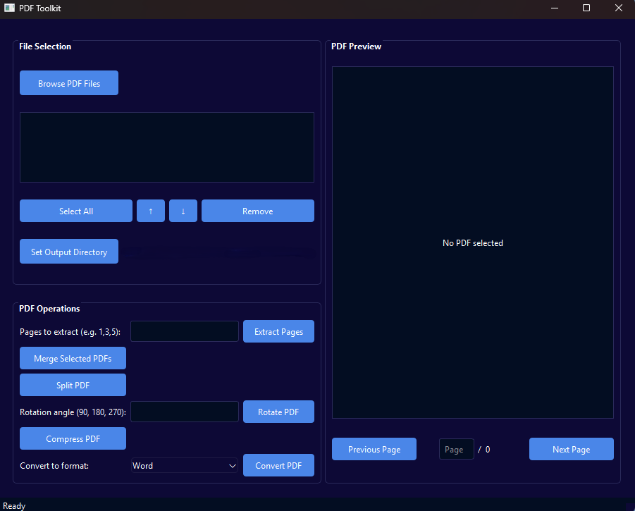

# 📑 PDF Tool
A powerful and modern PDF utility tool built with Python and PyQt6, offering comprehensive PDF manipulation features through an intuitive dark-themed interface.



## ✨ Features

### 📁 File Management
- 🔍 Select multiple PDF files via browse dialog
- 🖱️ Drag and drop PDF files directly into the application
- 🔄 Drag and drop support for reordering files
- ☑️ File list with checkboxes for selective operations
- 👀 Real-time PDF preview with page navigation
- 📌 "Select All" function for batch operations
- 🗂️ Remember last used directory

### 📄 PDF Operations
- 🔗 Combine multiple PDFs into a single file
- ✂️ Split PDFs into individual pages (with organized folder)
- 📑 Extract specific pages (supports ranges like "1,3,5-10")
- 🔄 Rotate PDF pages (90°, 180°, 270°)
- 🗜️ Compress PDFs to reduce file size
- 🔄 Convert PDFs to other formats:
  - 📝 Word (.docx)
  - 📊 Excel (.xlsx)
  - 📎 PowerPoint (.pptx)
  - 📄 Text (.txt)

### 🎨 User Interface
- 🌙 Modern dark theme interface
- 👀 Real-time PDF preview
- ⬅️➡️ Page navigation controls
- 📊 Status bar for operation feedback
- 📏 Resizable split-view layout

## 🚀 Usage

### 📁 File Selection
1. Click "Browse PDF Files" or drag and drop PDFs
2. Use checkboxes to select files for operations
3. Reorder files using drag and drop or arrow buttons
4. Set output directory to save results

### 📄 PDF Operations
- **🔗 Combine:** Select multiple PDFs and click "Merge Selected PDFs"
- **✂️ Split:** Select a PDF and click "Split PDF" (creates a folder with all pages)
- **📑 Extract:** Enter page numbers and click "Extract Pages"
- **🔄 Rotate:** Enter rotation angle and click "Rotate PDF"
- **🗜️ Compress:** Select a PDF and click "Compress PDF"
- **🔄 Convert:** Choose output format and click "Convert PDF"

### 👀 Preview
- Click any file to preview its contents
- Use navigation buttons or enter page numbers
- Preview updates automatically when selecting different files

## 📋 Requirements

- 🐍 Python 3.x
- 🖼️ PyQt6 (GUI framework)
- 📄 PyPDF2 (basic PDF manipulation)
- 📊 PyMuPDF (advanced PDF rendering and manipulation)
- 🔄 Additional libraries for conversion features:
  - 📝 pdf2docx (Word conversion)
  - 📊 tabula-py (Excel conversion)
  - 📎 python-pptx (PowerPoint conversion)
  - 📄 pdfplumber (text extraction)

## 🔧 Installation

1. Install Python: [Python Official Website](https://www.python.org/downloads/)
2. Install required libraries:
   ```bash
   pip install -r requirements.txt
   ```

## ⚠️ Notes

- ☕ Java is required for Excel conversion (using tabula-py)
- ⏳ Some operations may take longer for large PDF files
- 🗄️ Splitting a PDF creates a folder with all individual pages
- 💾 The program remembers last used directory
- 🛠️ Processed files are named with descriptive suffixes (_compressed, _rotated, etc.)

## 📄 License

[MIT](https://choosealicense.com/licenses/mit/)