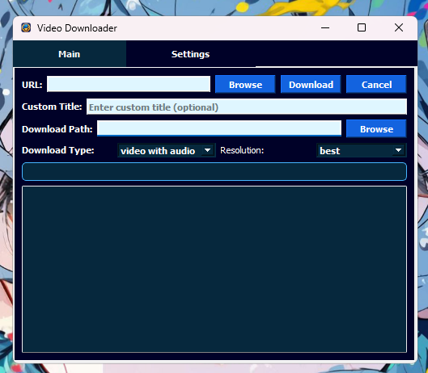
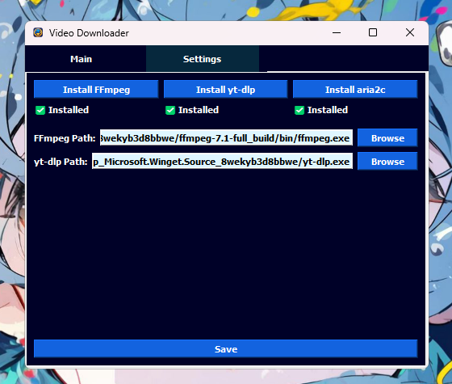

# 📥 Video Download App

**Features updated August 2025:**
- 🚀 Playlist numbering: Oldest video gets 01_, newest gets N_, even for YouTube watch URLs with list=.
- ⚡ Uses aria2/aria2c for all downloads (if installed) for maximum speed; falls back to yt-dlp/ffmpeg if not found.
- 🧩 Download speed optimized: concurrent fragments, HTTP chunking, ffmpeg reconnect for HLS/DASH.


A PyQt5-based application for downloading videos, audio, and live streams from various platforms using yt-dlp, FFmpeg, and aria2c.

<details>
<summary>🖼️ Application Screenshots</summary>

<div align="center">
  
  <p><em>Main Application Window</em></p>
  
  
  <p><em>Settings and Package Management</em></p>
</div>
</details>

## ✨ Features

1. **📼 Multiple Download Types:**
   - 🎥 Video only
   - 🎵 Audio only (MP3 format)
   - 🎞️ Video with audio
   - 🔴 Live stream recording

2. **⚙️ Advanced Options:**
   - 📊 Custom video resolutions (240p to 1080p)
   - 📝 Custom title naming
   - 📋 Batch downloads from text files
   - 📈 Progress tracking with detailed logs
   - ⏸️ Download pause and resume functionality
   - ⏹️ Download cancellation support
   - 🔧 Non-blocking package installations
   - 🔄 Automatic package updates when available

3. **🔧 Integration with:**
   - 🚀 yt-dlp for video downloading
   - 🎞️ FFmpeg for media processing
   - ⚡ aria2/aria2c for accelerated downloads (used by default if installed)
   
4. **⚡ Platform-Specific Optimizations:**
   - 🎮 Enhanced Twitch downloads with superior audio quality
   - 🔄 Automatic audio synchronization for Twitch streams
   - 📱 YouTube age-restricted content support
   - ⚡ Aria2/aria2c used for all eligible downloads for maximum speed
   - 🧩 Increased fragment concurrency and chunking for fast downloads


## 📥 Installation & Build

### 💿 Method 1: Using the Executable
1. ⬇️ Download the latest [VideoDownload.exe](https://github.com/JaredJomar/Projects/raw/main/VideoDownload/VideoDownload.exe)
2. 🏃 Run the application
3. ⚙️ Go to the Settings tab
4. 🔧 Use the installation buttons to install/update required dependencies:
   - Install/Update FFmpeg
   - Install/Update yt-dlp
   - Install/Update aria2c

### 💻 Method 2: From Source
1. Clone the repository
2. Install Python requirements:
   ```pwsh
   python -m pip install -r requirements.txt
   ```
3. Run the application and install dependencies through the Settings tab
4. To build with PyInstaller:
     ```pwsh
     python -m PyInstaller VideoDownloadToExecute.spec
     ```

## ⚙️ Configuration

1. Open the Settings tab
2. Install or update required packages using the provided buttons
3. Verify installation status (green checkmarks)
4. Paths will be automatically configured after installation
5. **Smart Updates**: Buttons automatically check for and install updates if packages are already installed

## 📚 Usage

### 🔰 Basic Download
1. Paste video URL
2. (Optional) Set custom title
3. Choose download path
4. Select download type
5. Pick resolution
6. Click Download
7. Use Pause/Resume button to control download progress

### ⏸️ Pause and Resume Downloads
1. **Pause**: Click the "Pause" button during an active download to suspend it
2. **Resume**: Click "Resume" to continue the download from where it was paused
3. **Benefits**: No need to restart downloads, saves bandwidth and time
4. **Compatibility**: Works with all supported platforms and download types

### 📋 Batch Download & Playlists
1. Create a text file with URLs (one per line) or paste a YouTube playlist/watch URL with list=.
2. Click Browse next to URL field or paste directly.
3. Configure other options.
4. Click Download.
5. Playlist videos are auto-numbered (01_, 02_, …) oldest to newest, even for watch URLs with list=.

### 🔴 Live Stream & Twitch Content
1. Paste live stream URL or Twitch video/clip URL
2. App automatically detects content type
3. For live streams:
   - Recording starts immediately
   - Use Cancel to stop recording
4. For Twitch videos:
   - Select "video with audio" and "best" resolution for highest quality
   - App handles audio synchronization automatically
   - Audio quality is set to maximum for all Twitch downloads

### 🍪 Browser Cookies for Age-Restricted Videos
1. In the Settings tab, select your browser under "Use Browser Cookies"
2. The app will read (but never save) cookies from your selected browser
3. For age-restricted videos, the app automatically retries with cookies if needed
4. Only the browser selection is saved, not the actual cookies

> **Note:** Cookies are only used when required for authentication or age-restricted content

## ❗ Troubleshooting

1. **📦 Dependencies Not Found:**
   - Check Settings tab for installation status
   - Verify paths are correct
   - Try reinstalling using the provided buttons

2. **❌ Download Fails:**
   - Check internet connection
   - Verify URL is valid
   - Look for errors in progress log

3. **📁 Path Issues:**
   - Use Browse buttons to set correct paths
   - Ensure write permissions in download folder

4. **🔒 App Freezes During Installation:**
   - **✅ Fixed!** Installations now run in background threads
   - Progress dialog shows real-time installation status
   - UI remains fully responsive during package installations
   - Multiple installations are prevented to avoid conflicts
   - **🔄 Smart Updates**: Automatically checks for updates when clicking install buttons

## 📄 License

[MIT](https://choosealicense.com/licenses/mit/)

## 👏 Credits

- 🚀 [yt-dlp](https://github.com/yt-dlp/yt-dlp)
- 🎞️ [FFmpeg](https://github.com/FFmpeg/FFmpeg)
- ⚡ [aria2](https://github.com/aria2/aria2)
- 🎨 [PyQt5](https://www.riverbankcomputing.com/software/pyqt/)
