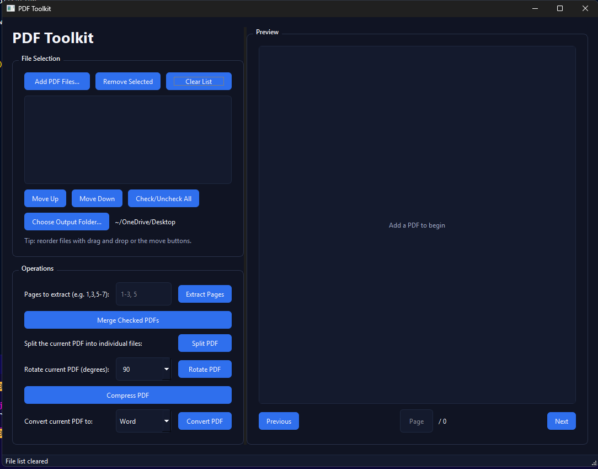

# PDF Toolkit
A modern PyQt6 desktop application for combining, splitting, converting, and previewing PDFs with a responsive dark UI and background processing.



## Features
- Manage multiple PDFs with drag-and-drop from Explorer/Finder, reordering, and checkbox selection
- Live preview with page navigation and per-file page memory
- Merge, split, extract, rotate, compress, and convert (Word/Excel/PowerPoint/Text)
- Background workers with progress dialogs keep the UI responsive
- Remembers recently used folders and restores window layout

## Project Structure
```
Pdf_Combiner/
|-- pdf_combiner/
|   |-- __init__.py
|   |-- __main__.py
|   |-- main.py               # Application entry point
|   |-- services/
|   |   |-- pdf_ops.py        # Pure PDF manipulation helpers
|   |-- ui/
|       |-- main_window.py    # PyQt6 MainWindow implementation
|       |-- preview.py        # PDF preview rendering utilities
|       |-- workers.py        # Background worker wrapper
|       |-- widgets.py        # Drag-and-drop enabled file list
|-- prototype/
|   |-- PdfCombiner_Tkinter.py  # Legacy Tkinter prototype
|-- requirements.txt
|-- README.md
|-- Run_PdfCombiner.bat
```

## Requirements
- Python 3.10+
- PyQt6
- PyPDF2
- PyMuPDF (fitz)
- pdf2docx
- tabula-py (requires Java for Excel export)
- pdfplumber
- python-pptx

Install everything with:
```bash
pip install -r requirements.txt
```

## Running the App
From the project:
```bash
python -u pdf_combiner\main.py
```

Other options:
- On Windows: double-click `Run_PdfCombiner.bat`

## Usage Highlights
1. Click **Add PDF Files...** or drag PDFs from your file explorer into the list.
2. Reorder via drag and drop or the move buttons; toggle checkboxes to target specific documents.
3. Set an output folder for operations that create files.
4. Use the **Operations** panel for merge, split, extract, rotate, compress, and convert.
5. The preview pane shows the active PDF with quick page navigation; resizing updates the preview automatically.

### Conversion Notes
- Excel conversion uses `tabula-py` and needs a Java runtime available on your PATH.
- Outputs receive descriptive suffixes such as `_compressed`, `_rotated`, or keep the original stem for conversions.

## Prototype UI
The legacy Tkinter implementation is preserved under `prototype/` for reference. It is not wired into the current launcher.

## License
[MIT](https://choosealicense.com/licenses/mit/)
